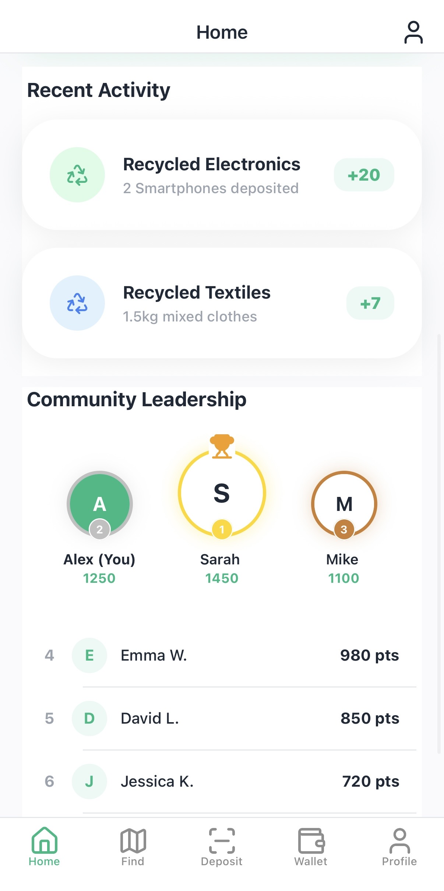
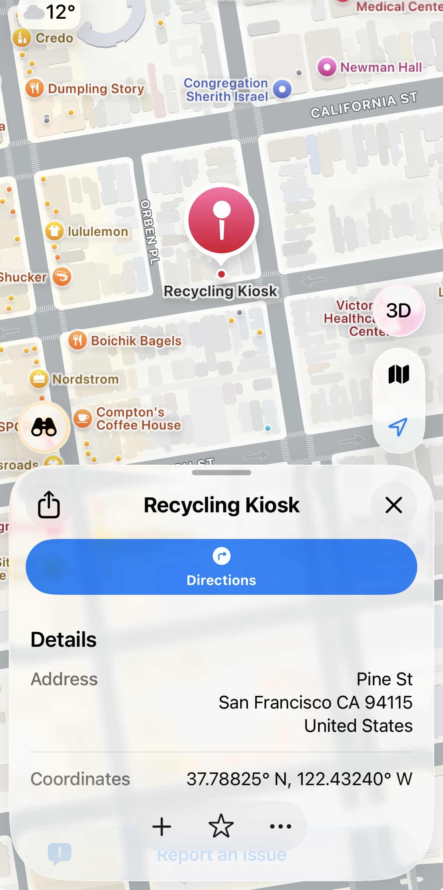
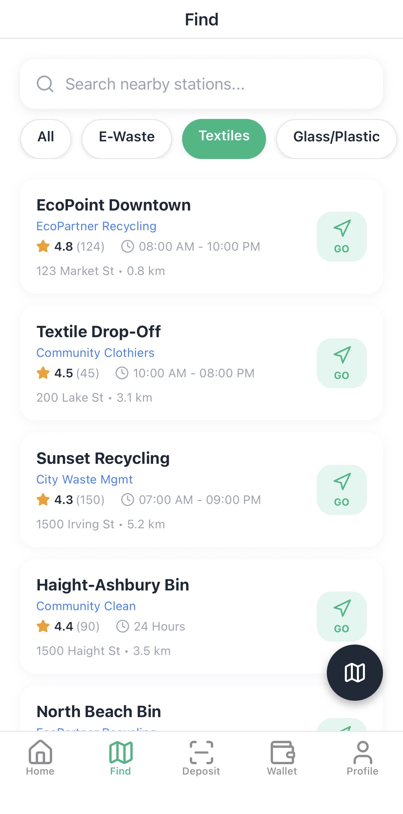
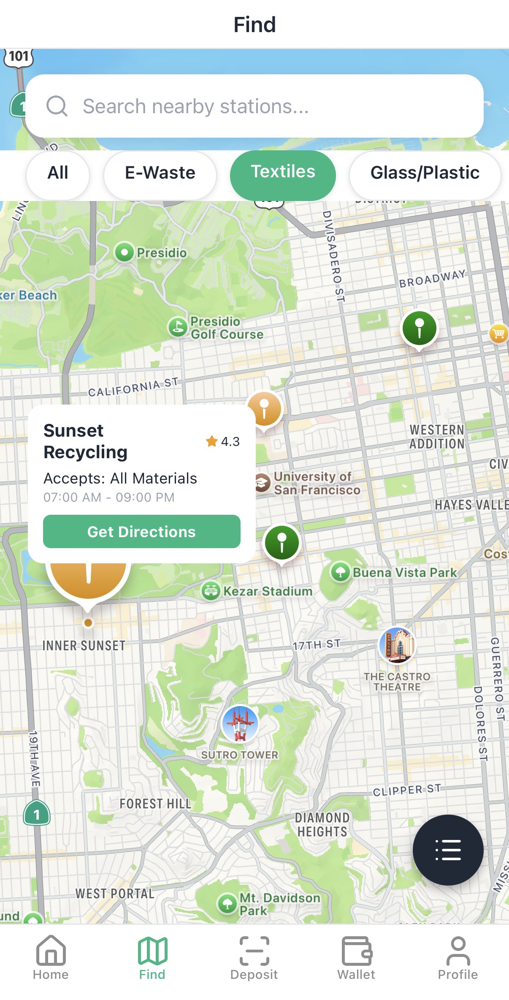
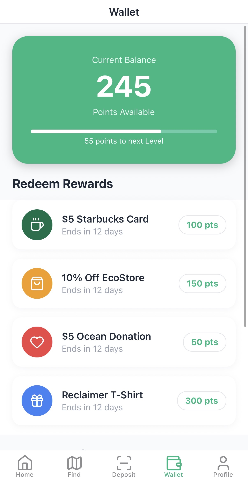
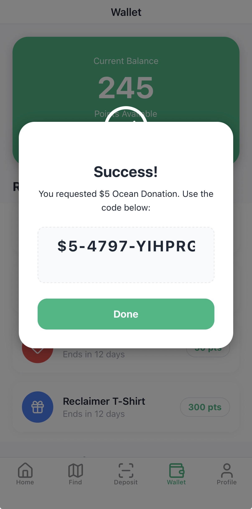
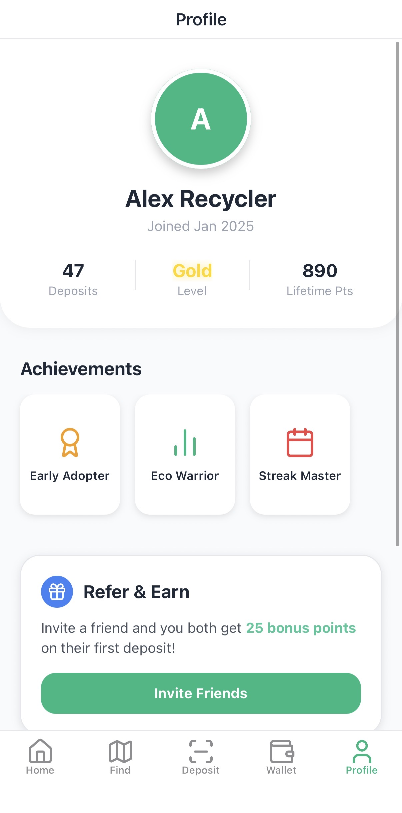

# 🌳 Reclaimer
**Gamifying the Circular Economy.**

> **Hackathon 2026 Submission**  
> *Sustainable. Social. Rewarding.*

---

## 🌎 The Mission: Why This Matters
We are facing a global waste crisis. The statistics are alarming:
*   **62 Million Tonnes** of e-waste are generated annually, with only **22.3%** properly recycled.
*   **91% of plastic** ever produced has not been recycled.
*   By 2050, there could be more plastic in the ocean than fish (by weight).

The core problem isn't just infrastructure—it's **participation**. Recycling is often confusing, inconvenient, and unrewarding for the average person. 

**Reclaimer** solves this by minimizing friction and maximizing motivation. We combine **AI-powered scanning**, **real-time impact tracking**, and **financial incentives** to turn recycling into a seamless, rewarding daily habit.

---

## 📸 App Gallery

<div align="center"> 
  <table>
    <tr>
      <td align="center"><br/><i>Secure Authentication</i></td>
      <td align="center"><br/><i>Home & Impact Summary</i></td>
      <td align="center"><br/><i>Nearby Kiosks</i></td>
    </tr>
    <tr>
      <td align="center"><br/><i>Smart AI Scanner</i></td>
      <td align="center"><br/><i>Live Object Detection</i></td>
      <td align="center"><br/><i>Deposit Confirmation</i></td>
    </tr>
    <tr>
      <td align="center"><br/><i>Points & Rewards</i></td>
      <td align="center"><br/><i>Community Rankings</i></td>
      <td align="center"><br/><i>User Profile & Stats</i></td>
    </tr>
  </table>
</div>

---

## 📱 Core Features

### 1. Smart Vision Scanning
*   **AI Recognition**: Instantly detects Plastic (PET), Aluminum, and Glass using `expo-camera`.
*   **Live Valuation**: Shows real-time point value for every item before you deposit.

### 2. Gamified Ecosystem
*   **Leaderboards**: Compete with friends and your local community.
*   **Impact Dashboard**: Visualize your CO₂ offset in real-world terms (e.g., "Car miles saved").

### 3. Rewards Wallet
*   **Eco-Points**: Accumulate points for every gram of recycled material.
*   **Redemption**: Exchange points for store discounts or donate to charity.

---

## 🛠️ Technical Stack
Built with a modern, scalable architecture to ensure a premium user experience.

### Frontend Framework
*   **React Native**: Core framework for cross-platform (iOS/Android) development.
*   **Expo (SDK 54)**: Managed workflow for rapid iteration and native module access.
*   **TypeScript**: Statically typed for robust, error-free code.

### UI & Animations
*   **Reanimated 3**: High-performance, declarative animations running on the UI thread (60fps).
*   **Lucide React Native**: Beautiful, consistent vector iconography.
*   **Custom Design System**: Implemented logically via reusable components in `headers/` and `components/`.

### Core Services
*   **Expo Camera**: Real-time camera stream processing for the scanning interface.
*   **React Native Maps**: Google Maps integration for the Kiosk Finder feature.
*   **Expo Router**: File-based routing for seamless deep linking and navigation stacks.
*   **Location Services**: `expo-location` for real-time user positioning and geofencing.

---

## 📂 Project Structure
A quick look at the top-level directory structure:

```
reclaimer-mobileapp/
├── app/                    # Expo Router file-based navigation
│   ├── (tabs)/             # Main tab navigator (Scan, Map, Wallet, etc.)
│   ├── _layout.tsx         # Root layout configuration
│   └── modal.tsx           # Global modals
├── components/             # Reusable UI components
│   ├── Themed.tsx          # Theme-aware primitives (Text, View)
│   └── ...
├── constants/              # App-wide constants (Colors, Layout)
├── screenshots/            # App showcase images
├── assets/                 # Static assets (fonts, icons)
├── package.json            # Dependencies and scripts
└── README.md               # Documentation
```

---

## 👥 The Team
**Yaakulya Sabbani** | **Rehnuma Taskin** | **Yiyang Xu**

---
*Built with 💚 for the Hackathon.*
