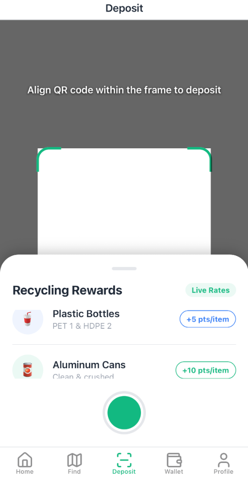
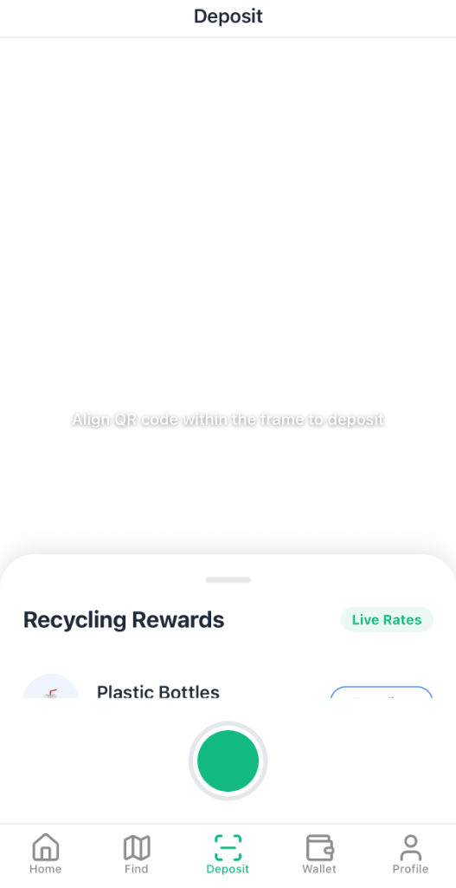
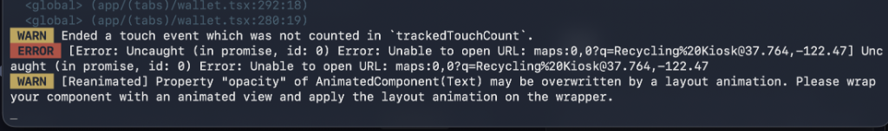
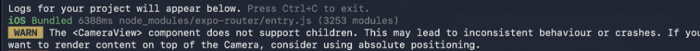

# Reclaimer 🌱  
**Gamifying the Circular Economy**

> **Winners of [Hackathon Name/Category]**  
> *Making recycling simple, rewarding, and social.*

<div align="center">
  
</div>

---

## 💡 The Problem
We all want to recycle, but the process is often **confusing, unrewarding, and isolated**.  
*Where is the nearest bin? Can I recycle this plastic? What's in it for me?*  
Reclaimer solves this by turning recycling into a **seamless, gamified experience**.

## ✨ Key Features

### 1. AI-Powered Smart Scanning
<table border="0">
  <tr>
    <td width="300"></td>
    <td>
      <h3>Scan & Earn instantly</h3>
      <p>Simply point your camera at any recyclable item. Our <b>Smart Vision</b> identifies the material (PET, Aluminum, Glass) and tells you exactly how much it's worth. No more guessing—just scan, drop, and earn.</p>
    </td>
  </tr>
</table>

### 2. Interactive Impact Map
<table border="0">
  <tr>
    <td>
      <h3>Find Kiosks Near You</h3>
      <p>Locate the nearest <b>Smart Recycling Kiosks</b> in seconds. Filter by material type, check live capacity status, and get turn-by-turn directions. Recycling has never been this accessible.</p>
    </td>
    <td width="300"></td>
  </tr>
</table>

### 3. Rewards Wallet & Marketplace
<table border="0">
  <tr>
    <td width="300"></td>
    <td>
      <h3>Your Trash, Your Treasure</h3>
      <p>Track your <b>Eco-Points</b> in real-time. Redeem them for real-world value—discounts at partner stores, crypto tokens, or donate them to environmental charities directly from the app.</p>
    </td>
  </tr>
</table>

### 4. Community Leaderboards
<table border="0">
  <tr>
    <td>
      <h3>Compete for a Greener Future</h3>
      <p>See where you stand among the top eco-warriors. Our <b>Podium-style leaderboard</b> celebrates the top recyclers every week. Earn badges, crowns, and bragging rights as you climb the ranks.</p>
    </td>
    <td width="300"></td>
  </tr>
</table>

---

## 🛠️ Tech Stack
Built with modern, scalable technologies to ensure a premium user experience.

- **Frontend**: React Native (Expo) - for cross-platform excellence.
- **Maps**: Google Maps API - for precise location tracking.
- **Animations**: Reanimated 3 - for buttery smooth 60fps interactions.
- **Styling**: Custom Design System - implementing Glassmorphism and premium aesthetics.

---

## 🚀 Getting Started

To run this project locally:

1. **Clone the repo**
   ```bash
   git clone https://github.com/yaakulya123/reclaimer-mobileapp.git
   ```

2. **Install dependencies**
   ```bash
   cd reclaimer-mobileapp
   npm install
   ```

3. **Run the app**
   ```bash
   npx expo start
   ```

---
*Built with 💚 by Team Reclaimer*
